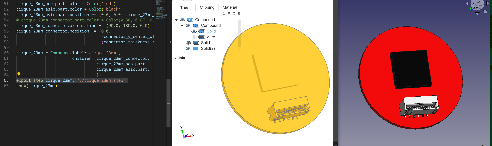

# build123d - compound object (with imported step file) viewer issue

This is a quick demo to just demonstrate a possible issue in OCP Cad Viewer where building a compound object that also includes a step file (compound object) seems to lead the OCP Cad Viewer to render with a single default color, even though the exported step file renders fine in another program (e.g. Freecad as shown in the screenshot's right side). 

Building a compound object purely with BuildPart routines (i.e. no importing) does seem to work okay.
